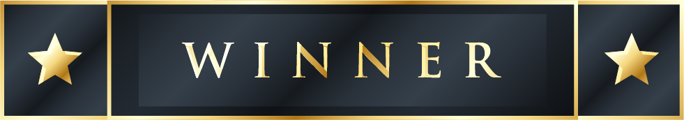

<!-- PROJECT LOGO -->
<br />
<p align="center">
  <a href="https://github.com/oubouhiam/TheWinner-Quiz-Web-App-NodeJs-ReactJs">
    
  </a>
  <h3 align="center">The Winner</h3>
    <p align="center">
    Application de jeux en ligne nomée "The Winner" créer en Node JS et React JS.
    <br />
    <a href="#"><strong>Explore the docs »</strong></a>
    <br />
    <br />
    <a href="#">View Demo</a>
    ·
    <a href="#">Report Bug</a>
    ·
    <a href="#">Request Feature</a>
  </p>
</p>
<!-- ABOUT THE PROJECT -->
## About The Project

[![Product Name Screen Shot][product-screenshot]](https://github.com/oubouhiam/TheWinner-Quiz-Web-App-NodeJs-ReactJs)

[![Product Name Screen Shot][TheWinning-screenshot]](https://github.com/oubouhiam/TheWinner-Quiz-Web-App-NodeJs-ReactJs)

[![Product Name Screen Shot][product-screenshot]](https://github.com/oubouhiam/TheWinner-Quiz-Web-App-NodeJs-ReactJs)

[![Product Name Screen Shot][product-screenshot1]](https://github.com/oubouhiam/TheWinner-Quiz-Web-App-NodeJs-ReactJs)
[![Product Name Screen Shot][product-screenshot2]](https://github.com/oubouhiam/TheWinner-Quiz-Web-App-NodeJs-ReactJs)
[![Product Name Screen Shot][product-screenshot3]](https://github.com/oubouhiam/TheWinner-Quiz-Web-App-NodeJs-ReactJs)
[![Product Name Screen Shot][product-screenshot4]](https://github.com/oubouhiam/TheWinner-Quiz-Web-App-NodeJs-ReactJs)
[![Product Name Screen Shot][product-screenshot5]](https://github.com/oubouhiam/TheWinner-Quiz-Web-App-NodeJs-ReactJs)
[![Product Name Screen Shot][product-screenshot6]](https://github.com/oubouhiam/TheWinner-Quiz-Web-App-NodeJs-ReactJs)
[![Product Name Screen Shot][product-screenshot7]](https://github.com/oubouhiam/TheWinner-Quiz-Web-App-NodeJs-ReactJs)

On souhaite créer une application de jeux en ligne nomée "The Winner" pour se faire on a besoin de créer une API en Node JS et consommer en React JS le déroulement de l'application est comme suit:

Backoffice

l'administrateur de l'application entre les catégorie de chaque jeux via son interface backoffice.

FrontOffice: *un utilisateur doit s'inscrire pour passer le jeux "The Winner" *chaque utilisateur peut choisir au début la catégorie de son jeux *chaque utilisateur a le droit de passer 3 essais maximum pour réussir le jeux The Winner s'il echoue dans une question, il doit repasser le test *l'utilisateur peut passer la question (cette question est annulée sur son solde) *chaque question vaut 10 points *le total des pint du jeux est 100 points à la fin de jeux l'utilisateur consulte son solde de point s'il a gagné ou non *le premier prix du jeux est 100 points *le deuxième prix du jeux est 100 points *le troisième prix du jeux est 100 points

*une fois le client a gagné le jeux, il recevera un email de confirmation qui contiendra le descriptif de son cadeau

*un fichier log sera enregistré dans le système à l'aide d'un module comme Winston ou Morgan

### Built With

List aof frameworks that built on this project.
* [Bootstrap](https://getbootstrap.com)
* [JQuery](https://jquery.com)
* [HTML5](https://www.w3schools.com/html/)
* [Node.js](https://nodejs.org/)
* [noSQL](https://www.mongodb.com/nosql-explained)
* [React](https://reactjs.org/)


<!-- GETTING STARTED -->
## Getting Started

How to excute application:

### Prerequisites

* npm
  ```sh
  npm install npm@latest -g
  ```

### Installation

1. Clone the repo
   ```sh
   git clone https://github.com/YassineCherkaoui/Application_de_jeux_en_ligne_nomee_The_Winner
   ```
2. Install NPM packages
   ```sh
   npm install
   ```
  in (/back-end) & (/front-end)

3. Go to the the file (back-end)
   ```sh
   nodemon ./server.js
   ```

3. Go to the the file (front-end)
   ```sh
   NPM start
   ```

4. Go to Your Browser
   ```sh
    http://localhost:3000/
   ```


<!-- LICENSE -->
## License

Distributed under the MIT License. See `LICENSE` for more information.

Project Link: [https://github.com/oubouhiam/TheWinner-Quiz-Web-App-NodeJs-ReactJs](https://github.com/oubouhiam/TheWinner-Quiz-Web-App-NodeJs-ReactJs)


<!-- ACKNOWLEDGEMENTS -->
## Acknowledgements
* [GitHub Emoji Cheat Sheet](https://www.webpagefx.com/tools/emoji-cheat-sheet)
* [Img Shields](https://shields.io)
* [Choose an Open Source License](https://choosealicense.com)
* [GitHub Pages](https://pages.github.com)
* [Animate.css](https://daneden.github.io/animate.css)
* [Loaders.css](https://connoratherton.com/loaders)
* [Slick Carousel](https://kenwheeler.github.io/slick)
* [Smooth Scroll](https://github.com/cferdinandi/smooth-scroll)
* [Sticky Kit](http://leafo.net/sticky-kit)
* [JVectorMap](http://jvectormap.com)
* [Font Awesome](https://fontawesome.com)


[product-screenshot]: Screenshot/screenshot.png
[TheWinning-screenshot]: Screenshot/video.gif
[product-screenshot2]: Screenshot/signup.png
[product-screenshot3]: Screenshot/login.png
[product-screenshot4]: Screenshot/list-category.png
[product-screenshot5]: Screenshot/game.png
[product-screenshot6]: Screenshot/dashboard.png
[product-screenshot7]: Screenshot/crudCtagrie.png

